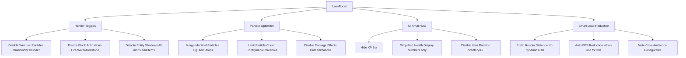

```mermaid
flowchart TD
    A[LazyBoost] --> B[Render Toggles]

    A --> C[Particle Optimizer]

    A --> D[Minimal HUD]

    A --> E[Smart Load Reduction]

    B --> B1[Disable Weather Particles Rain/Snow/Thunder]

    B --> B2[Freeze Block Animations Fire/Water/Redstone]

    B --> B3[Disable Entity Shadows All mobs and items]

    C --> C1[Merge Identical Particles e.g. item drops]

    C --> C2[Limit Particle Count Configurable threshold]

    C --> C3[Disable Damage Effects Hurt animations]

    D --> D1[Hide XP Bar]

    D --> D2[Simplified Health Display Numbers only]

    D --> D3[Disable Item Rotation Inventory/GUI]

    E --> E1[Static Render Distance No dynamic LOD]

    E --> E2[Auto FPS Reduction When idle for 30s]

    E --> E3[Mute Cave Ambience Configurable]

```
