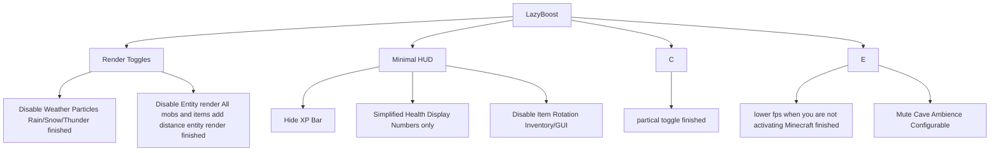

```mermaid
flowchart TD
    A[LazyBoost] --> B[Render Toggles]

    A --> D[Minimal HUD]

    B --> B1[Disable Weather Particles Rain/Snow/Thunder finished]

    B --> B2[Disable Entity render All mobs and items add distance entity render finished]

    A --> C

    A --> E

    C --> C1[partical toggle finished]

    D --> D1[Hide XP Bar]

    D --> D2[Simplified Health Display Numbers only]

    D --> D3[Disable Item Rotation Inventory/GUI]

    E --> E1[lower fps when you are not activating Minecraft finished]

    E --> E2[Mute Cave Ambience Configurable]

```
